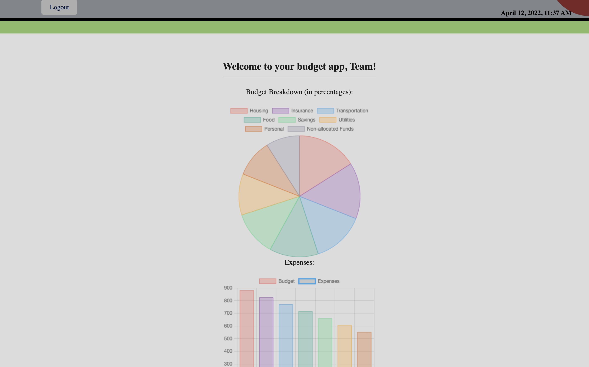

# budget-tracking-app

<div id="top"></div>
<!--
*** Thanks for checking out the Best-README-Template. If you have a suggestion
*** that would make this better, please fork the repo and create a pull request
*** or simply open an issue with the tag "enhancement".
*** Don't forget to give the project a star!
*** Thanks again! Now go create something AMAZING! :D
-->


<!-- PROJECT SHIELDS -->
<!--
*** I'm using markdown "reference style" links for readability.
*** Reference links are enclosed in brackets [ ] instead of parentheses ( ).
*** See the bottom of this document for the declaration of the reference variables
*** for contributors-url, forks-url, etc. This is an optional, concise syntax you may use.
*** https://www.markdownguide.org/basic-syntax/#reference-style-links
-->

[](https://opensource.org/licenses/MIT)




<!-- PROJECT LOGO
<br />
<div align="center">
    
  </a>

<h3 align="center">budget-tracking-app</h3>

  <p align="center">
    project_description
    <br />
    <a href="https://github.com/github_username/repo_name"><strong>Explore the docs »</strong></a>
    <br />
    <br />
    <a href="https://github.com/github_username/repo_name">View Demo</a>
    ·
    <a href="https://github.com/github_username/repo_name/issues">Report Bug</a>
    ·
    <a href="https://github.com/github_username/repo_name/issues">Request Feature</a>
  </p>
</div> -->


<!-- TABLE OF CONTENTS -->
<details>
  <summary>Table of Contents</summary>
  <ol>
    <li>
      <a href="#about-the-project">About The Project</a>
      <ul>
        <li><a href="#built-with">Built With</a></li>
      </ul>
    </li>
    <li>
      <a href="#getting-started">Getting Started</a>
      <ul>
        <li><a href="#prerequisites">Prerequisites</a></li>
        <li><a href="#installation">Installation</a></li>
      </ul>
    </li>
    <li><a href="#usage">Usage</a></li>
    <li><a href="#roadmap">Roadmap</a></li>
    <li><a href="#contributing">Contributing</a></li>
    <li><a href="#license">License</a></li>
    <li><a href="#contact">Contact</a></li>
    <li><a href="#acknowledgments">Acknowledgments</a></li>
  </ol>
</details>


<!-- ABOUT THE PROJECT -->
## About The Project

* Concept and Motivation: We wanted to create an easy to use expense tracking and budgeting application that allows users to take control of their financial future.

* Design Process: First, the Team brainstormed on what features make the most sense to aide the users while using our application. Second, we wanted to design an easy to use API for expense/income and budgeting with a schema. Finally, on the front end, we framed a concept that works seamlessly with the backend API.


<p align="right">(<a href="#top">back to top</a>)</p>


### Built With

* [Express.js](https://expressjs.com/)
* [Handlebars.js](https://handlebarsjs.com/)
* [Heroku](https://id.heroku.com/login)
* [MySQL](https://www.mysql.com/)
* [Node.js](https://nodejs.dev/)

<p align="right">(<a href="#top">back to top</a>)</p>


<!-- GETTING STARTED -->
## Getting Started

To get a local copy up and running, follow these simple steps.


### Prerequisites

This is an example of how to list things you need to use the software and how to install them.
* npm
  ```sh
  npm install npm@latest -g
  ```
* MySQL download: [https://www.mysql.com/](https://www.mysql.com/)   

### Installation

1. Get a free API Key at [https://newsapi.org/](https://newsapi.org/)

2. Clone the GitHub repository:
   ```sh
   git clone https://github.com/b-e-christensen/budget-tracking-app
   ```
3. Install NPM packages:
   ```sh
   cd budget-tracking-app && npm install
4. Source the database. From MySQL CLI interface:
    ```sh
    source db/schema.sql
    ```
5. Configure the .env file with:
   ```js
    DB_NAME=budget_tracker_db
    DB_USER=<your db user>
    DB_PW=<your db password>
    SESS_SECRET=<secure key for cookie gen>
    API_KEY=<NEWS API KEY>
   ```

<p align="right">(<a href="#top">back to top</a>)</p>


<!-- USAGE EXAMPLES -->
## Usage

1. Sign up and Log into your Budgettly account.

2. Enter your monthly income and click the submit button.

3. Name your budget.

4. Enter the % of income for each corresponding expense. Once finished, click the Save Budget button.

5. Your budget will be displayed within a pie chart as well as a bar graph.

<!-- _For more examples, please refer to the [Documentation](https://example.com)_ -->

<p align="right">(<a href="#top">back to top</a>)</p>


<!-- ROADMAP -->
## Roadmap for future development

- Improved UX by adding more client-side error handling and better mobile support.
- Auto-Expense: Direct banking API integration to automatically pull recent expenses.
- Oauth: Allows the user to sign in with their Google or Facebook accounts.

<!-- See the [open issues](https://github.com/github_username/repo_name/issues) for a full list of proposed features (and known issues). -->

<p align="right">(<a href="#top">back to top</a>)</p>


<!-- CONTRIBUTING -->
## Contributing

Contributions are what make the open source community such an amazing place to learn, inspire, and create. Any contributions you make are **greatly appreciated**.

If you have a suggestion that would make this better, please fork the repo and create a pull request. You can also simply open an issue with the tag "enhancement".
Don't forget to give the project a star! Thanks again!

1. Fork the Project
2. Create your Feature Branch (`git checkout -b feature/AmazingFeature`)
3. Commit your Changes (`git commit -m 'Add some AmazingFeature'`)
4. Push to the Branch (`git push origin feature/AmazingFeature`)
5. Open a Pull Request

<p align="right">(<a href="#top">back to top</a>)</p>


<!-- LICENSE -->
<!-- ## License

[](https://opensource.org/licenses/MIT) -->


<p align="right">(<a href="#top">back to top</a>)</p>


<!-- CONTACT -->
## Contact

<!-- Your Name - [@twitter_handle](https://twitter.com/twitter_handle) - email@email_client.com -->

Project Link: [https://github.com/b-e-christensen/budget-tracking-app](https://github.com/b-e-christensen/budget-tracking-app)

<p align="right">(<a href="#top">back to top</a>)</p>


<!-- ACKNOWLEDGMENTS -->
## Acknowledgments

* Ben Christensen
* Chris LeClair
* George "Space Bear" Yoo
* Johnchris "Anon" Doeavis
* Kyle Salmons

<p align="right">(<a href="#top">back to top</a>)</p>